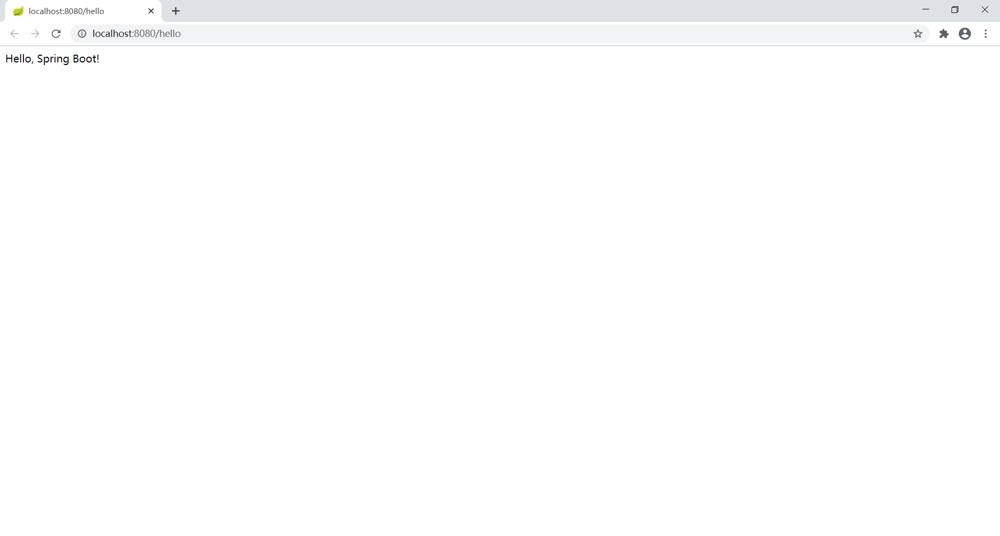
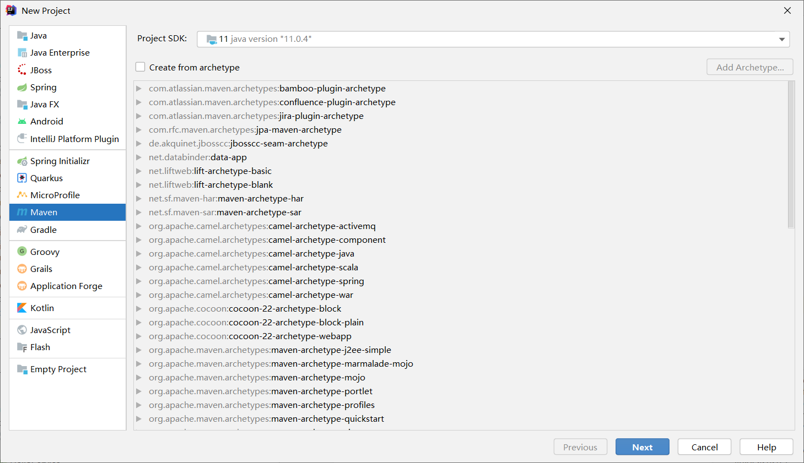
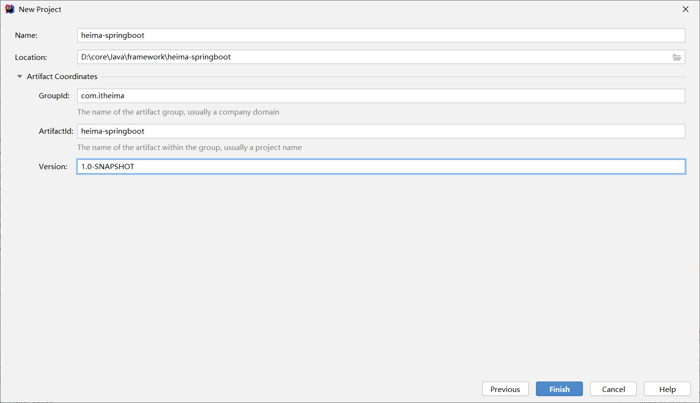

# SpringBoot入门

## 目标

访问 http://localhost:8080/hello 得出以下结果：

## 实现步骤

1. 创建工程
2. 添加依赖（启动器依赖，spring-boot-starter-web）
3. 创建启动类
4. 创建处理器Controller
5. 测试

### 创建工程

#### 创建 maven 项目

#### 配置名字与位置

### 添加依赖

> heima-springboot\pom.xml
>

### 创建启动类

> heima-springboot\src\main\java\com\itheima\Application.java

### 创建处理器Controller

> heima-springboot\src\main\java\com\itheima\controller\HelloController.java

### 测试

点击运行后访问 http://localhost:8080/hello

