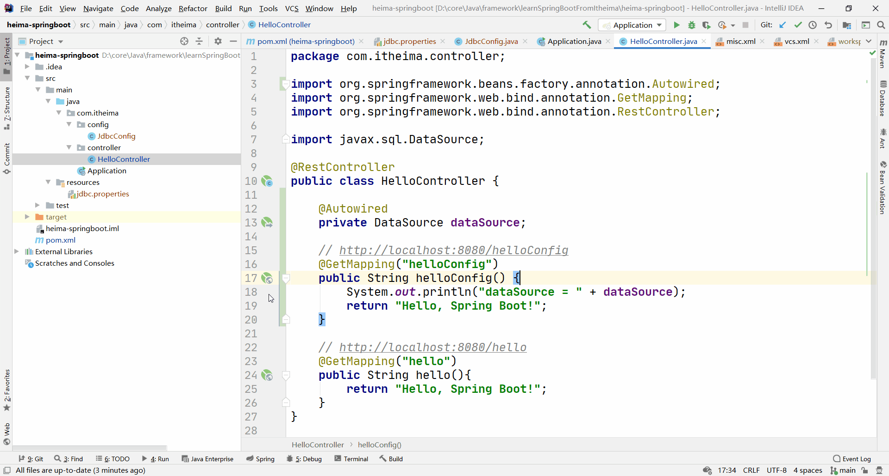

# SpringBoot入门

## 目标

访问 http://localhost:8080/hello 得出以下结果：


## 实现步骤

1. 创建工程
2. 添加依赖（启动器依赖，spring-boot-starter-web）
3. 创建启动类
4. 创建处理器Controller
5. 测试

### 创建工程

#### 创建 maven 项目


#### 配置名字与位置


### 添加依赖

> heima-springboot\pom.xml
>

### 创建启动类

> heima-springboot\src\main\java\com\itheima\Application.java

### 创建处理器Controller

> heima-springboot\src\main\java\com\itheima\controller\HelloController.java

### 测试

点击运行后访问 http://localhost:8080/hello


# java配置应用

## 目标

使用Java代码配置数据库连接池，并可以在处理器中注入并使用

## 步骤

1. 添加依赖；
2. 创建数据库；
3. 创建数据库连接参数的配置文件jdbc.properties；
4. 创建配置类；
5. 改造处理器类注入数据源并使用
6. 测试

### 添加依赖

> heima-springboot\pom.xml

### 创建数据库

准备好本地 MySQL 数据库，账号密码都为 `root`  ,再创建数据库 `springboot_test` 


### 创建数据库连接参数的配置文件jdbc.properties

> heima-springboot\src\main\resources\jdbc.properties

### 创建配置类

> heima-springboot\src\main\java\com\itheima\config\JdbcConfig.java

### 改造处理器类注入数据源并使用

> heima-springboot\src\main\java\com\itheima\controller\HelloController.java
>

### 测试



# SpringBoot属性注入方式

## 目标

使用@ConfigurationProperties实现SpringBoot配置文件配置项读取和应用，即将配置文件中的配置项读取到一个对象中

## 实现步骤

1. 创建配置项类JdbcProperties
2. 创建application.properties
3. 将JdbcProperties对象注入到JdbcConfig
4. 测试

### 创建配置项类JdbcProperties

> heima-springboot\src\main\java\com\itheima\config\JdbcProperties.java

在该类名上面添加 `@ConfigurationProperties` 完成注入

#### Error

> heima-springboot\pom.xml

[spring boot configuration annotation processor not configured 错误解决方案](https://blog.csdn.net/weixin_42362496/article/details/103805993)

###   创建application.properties

> heima-springboot\src\main\resources\application.properties

```properties
#跟前面的进行区分
jdbc.url=jdbc:mysql://127.0.0.1:3306/springboot_test2
```

###   将JdbcProperties对象注入到JdbcConfig

> heima-springboot\src\main\java\com\itheima\config\JdbcProperties.java

###   测试

> heima-springboot\src\main\java\com\itheima\controller\HelloController.java
>


#  单个Yaml配置文件

## 目标

使用 yml

## 步骤

### 增加 helloYml 

> heima-springboot\src\main\resources\application.yml

删除下面的两个文件，避免干扰

> heima-springboot\src\main\resources\application.properties

> heima-springboot\src\main\resources\jdbc.properties

### 创建 Controller

> heima-springboot\src\main\java\com\itheima\controller\HelloController.java
>

## 测试


# 多个Yaml配置文件

## 目标

使用 多个 yml

## 步骤

### 创建多个 yml

> heima-springboot\src\main\resources\application-abc.yml

> heima-springboot\src\main\resources\application-def.yml

### 激活

> heima-springboot\src\main\resources\application.yml

### 创建 public String helloYml()

> heima-springboot\src\main\java\com\itheima\controller\HelloController.java

## 测试


#  Spring Boot整合SpringMVC端口和静态资源

## 静态资源位置

搜索 `ResourceProperties.class` 可知静态资源放置路径如下：

```java
private static final String[] CLASSPATH_RESOURCE_LOCATIONS = new String[]{"classpath:/META-INF/resources/", "classpath:/resources/", "classpath:/static/", "classpath:/public/"};
```

# SpringBoot整合SpringMVC拦截器

## 目标

访问资源的过程中调用拦截器的preHandle(..)、postHandle(..)、afterCompletion(..) 三个方法。

## 步骤

Spring MVC的拦截器（Interceptor）和Filter不同，但是也可以实现对请求进行预处理，后处理。先介绍它的使用，只需要两步：

### 实现拦截器

 实现拦截器可以通过继承HandlerInterceptorAdapter类。如果preHandle方法return true，则继续后续处理。

> heima-springboot\src\main\java\com\itheima\interceptor\MyInterceptor.java

### 注册拦截器

> heima-springboot\src\main\java\com\itheima\config\MvcConfig.java

## 测试


## 总结

工作原理： 一个拦截器，只有preHandle方法返回true，postHandle、afterCompletion才有可能被执行；如果preHandle方法返回false，则该拦截器的postHandle、afterCompletion必然不会被执行。


